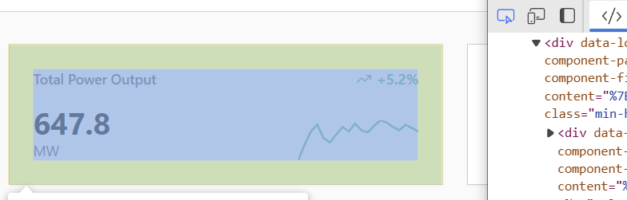
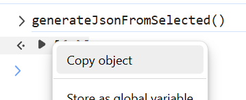
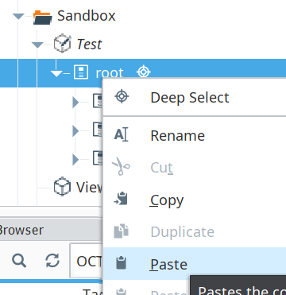

# web2Perspective
Convert your design - or any webpage - Into ignition perspective. 

Here is a tiny guide on how to use the script:

## Usage

1.  Open your browser's Developer Tools (F12 or Ctrl+Shift+I / Cmd+Option+I).
2.  Go to the **Console** tab.
3.  Type `allow pasting` and press Enter if prompted by the browser.
4.  Paste the entire script content (from `autoPerspective.js` or the latest version provided) into the console and press Enter.
5.  Use the **Inspector/Elements** tab to select the HTML element you want to convert.
6.  Go back to the **Console** tab.
7.  Type `generateJsonFromSelected()` and press Enter.
8.  The script will output the generated JSON object, which you can then copy.

### Steps with Details

1.  **Open DevTools:** Press `F12` or `Ctrl+Shift+I` (Windows/Linux) or `Cmd+Option+I` (Mac) in your browser.
2.  **Navigate to Console:** Click on the "Console" tab in the DevTools window.
3.  **Allow Pasting (if needed):**
    *   If you see a message like "Paste is disabled for security reasons", type `allow pasting` into the console input line and press `Enter`.
4.  **Paste the Script:**
    *   Copy the entire content of the script (e.g., from `autoPerspective.js`). (Open it on a notepad, the copy all the file)
    *   Paste it into the Console input area and press `Enter`. You should see a confirmation message like "Enhanced JSON DOM Generator loaded!".
5.  **Select an Element:**
    *   Click on the "Elements" or "Inspector" tab in DevTools.
    *   Use the mouse cursor tool to click on the element in the rendered page that you want to convert, or select it in the HTML tree structure.
    *   
6.  **Generate JSON:**
    *   Switch back to the "Console" tab.
    *   Type `generateJsonFromSelected()` into the console input line and press `Enter`.
7.  **Copy the Output:**
    *   The console will print the resulting JSON object (or an array containing the object).
    *   You can right-click the output and choose "Copy object" or similar, or select the text and copy it manually.
    *   
8.  **Paste the Output:**
    *   Open your designer and go into your view.
    *   You can right-click the output and choose "Paste"
    *   
  
Enjoy !
